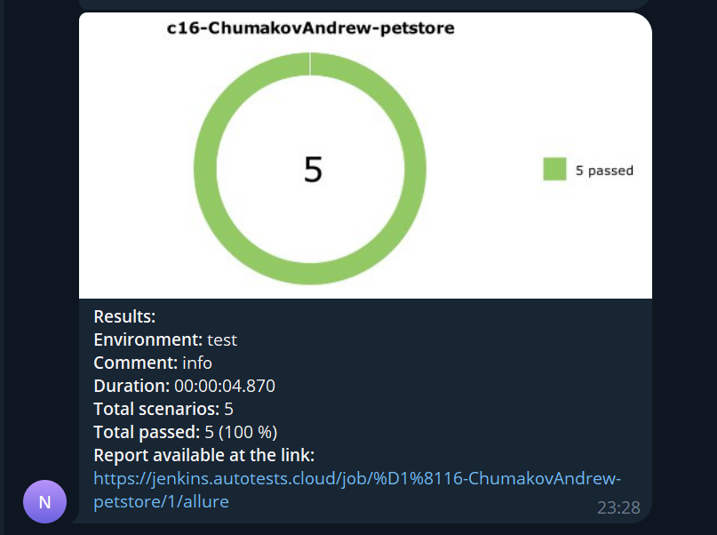

<h1 align="center">Проект автоматизации тестирования api Petstore</h1>

# Описание

### Кейсы:
- Создание заказа
- Удаление существующего заказа
- Невозможность удаления несуществующего заказа
- Получение существующего заказа
- Невозможность получения существующего заказа


### Используемый стек технологий и инструментов:

| Python                                                | Pycharm                                                | Git                                                | Pytest                                                | Selene                                                | Allure <br/> Report                                   | Jenkins                                                |                                                Telegram |
|:------------------------------------------------------|--------------------------------------------------------|----------------------------------------------------|-------------------------------------------------------|-------------------------------------------------------|-------------------------------------------------------|--------------------------------------------------------|--------------------------------------------------------:|
|  |  |  |  |  |  |  |  |


# Запуск тестов c заданными параметрами
```   
python -m venv .venv
source .venv/bin/activate
pip install -r requirements.txt
pytest --browser_address=${BROWSER_ADDRESS}
```
# Сборка в Jenkins
Для запуска сборки необходимо перейти в раздел **"Build with Parameters"**, указать адрес браузера и нажать кнопку **"Build"**.

<p align="center">
 
</p>

# Интеграция с Allure Report
<p align="center">   
    
</p>

# Уведомление в Telegram
<p align="center">   
    
</p>

